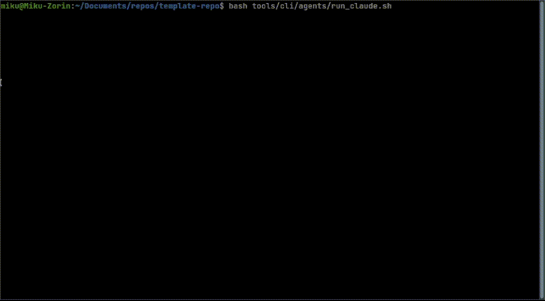

# MCP-Enabled Project Template

A comprehensive development ecosystem with 7 AI agents, 11 MCP servers, and complete CI/CD automation - all running on self-hosted, zero-cost infrastructure.



## Project Philosophy

This project follows a **container-first approach**:

- **All Python tools and CI/CD operations run in Docker containers** for maximum portability
- **MCP tools are containerized** except where Docker-in-Docker would be required (e.g., Gemini CLI)
- **Zero external dependencies** - runs on any Linux system with Docker
- **Self-hosted infrastructure** - no cloud costs, full control over runners
- **Single maintainer design** - optimized for individual developer productivity
- **Modular MCP architecture** - Separate specialized servers for different functionalities

## AI Agents

Seven AI agents working in harmony for development and automation. See [AI Agents Documentation](docs/ai-agents/README.md) for complete details:

1. **Claude Code** - Primary development assistant
2. **OpenCode** - Comprehensive code generation ([Integration Guide](docs/integrations/ai-services/opencode-crush.md))
3. **Crush** - Fast code generation ([Quick Reference](docs/integrations/ai-services/opencode-crush-ref.md))
4. **Gemini CLI** - Automated PR reviews
5. **GitHub Copilot** - Code review suggestions
6. **Issue Monitor Agent** - Automated issue management
7. **PR Review Monitor Agent** - Automated review response

**Security**: Keyword triggers, user allow list, secure token management. See [AI Agents Security](docs/ai-agents/security.md)

## Features

- **11 MCP Servers** - Modular tools for code quality, content creation, AI assistance, 3D graphics, speech synthesis, and more
- **7 AI Agents** - Comprehensive development automation
- **Gaea2 Terrain Generation** - Terrain generation
- **Blender 3D Creation** - Full 3D content creation, rendering, and simulation
- **ComfyUI & AI Toolkit** - Image generation and LoRA training
- **Container-First Architecture** - Maximum portability and consistency
- **Self-Hosted CI/CD** - Zero-cost GitHub Actions infrastructure
- **Automated PR Workflows** - AI-powered reviews and fixes

## Quick Start

1. **Prerequisites**
   - Linux system (Ubuntu/Debian recommended)
   - Docker (v20.10+) and Docker Compose (v2.0+)
   - No other dependencies required!

2. **Clone and setup**
   ```bash
   git clone https://github.com/AndrewAltimit/template-repo
   cd template-repo

   # Install AI agents package (for CLI tools)
   pip3 install -e ./packages/github_ai_agents

   # Set up API keys (if using AI features)
   export OPENROUTER_API_KEY="your-key-here"  # For OpenCode/Crush
   export GEMINI_API_KEY="your-key-here"      # For Gemini
   ```

3. **Use MCP servers with Claude Code**
   - MCP servers are configured in `.mcp.json`
   - Claude Code automatically starts them via STDIO
   - No manual startup required!

4. **For standalone usage**
   ```bash
   # Start HTTP servers for testing/development
   docker-compose up -d

   # Test all servers
   python automation/testing/test_all_servers.py --quick

   # Use AI agents directly
   ./tools/cli/agents/run_opencode.sh -q "Create a REST API"
   ./tools/cli/agents/run_crush.sh -q "Binary search function"
   ```

For detailed setup instructions, see [CLAUDE.md](CLAUDE.md)

## Project Structure

```
.
├── .github/workflows/        # GitHub Actions workflows
├── docker/                   # Docker configurations
├── packages/                 # Installable packages
│   └── github_ai_agents/     # AI agent implementations
├── tools/                    # MCP servers and utilities
│   ├── mcp/                  # Modular MCP servers
│   │   ├── code_quality/     # Formatting & linting
│   │   ├── content_creation/ # Manim & LaTeX
│   │   ├── gemini/           # AI consultation
│   │   ├── gaea2/            # Terrain generation
│   │   ├── blender/          # 3D content creation
│   │   ├── opencode/         # Code generation
│   │   ├── crush/            # Code generation
│   │   ├── meme_generator/   # Meme creation
│   │   ├── elevenlabs_speech/# Speech synthesis
│   │   ├── ai_toolkit/       # LoRA training bridge
│   │   ├── comfyui/          # Image generation bridge
│   │   └── core/             # Shared components
│   └── cli/                  # Command-line tools
├── automation/               # CI/CD and automation scripts
├── tests/                    # Test files
├── docs/                     # Documentation
├── config/                   # Configuration files
├── .context/                 # AI context files
│   └── PROJECT_CONTEXT.md    # Context for AI reviewers
└── projects/                 # Separate projects
```

## MCP Servers

### Available Servers

1. **Code Quality** - Formatting, linting, auto-formatting
2. **Content Creation** - Manim animations, LaTeX, TikZ diagrams
3. **Gaea2** - Terrain generation ([Documentation](tools/mcp/gaea2/docs/README.md))
4. **Blender** - 3D content creation, rendering, physics simulation ([Documentation](tools/mcp/blender/docs/README.md))
5. **Gemini** - AI consultation (host-only due to Docker requirements)
6. **OpenCode** - Comprehensive code generation (STDIO mode via Claude)
7. **Crush** - Fast code snippets (STDIO mode via Claude)
8. **Meme Generator** - Create memes with templates
9. **ElevenLabs Speech** - Advanced text-to-speech synthesis with emotional control
10. **AI Toolkit** - LoRA training bridge (remote: 192.168.0.152:8012)
11. **ComfyUI** - Image generation bridge (remote: 192.168.0.152:8013)

### Usage Modes

- **STDIO Mode** (for Claude Code): Configured in `.mcp.json`, auto-started by Claude
- **HTTP Mode** (for testing/APIs): Run with `docker-compose up`

See [MCP Architecture Documentation](docs/mcp/README.md) and [STDIO vs HTTP Modes](docs/mcp/architecture/stdio-vs-http.md) for details.

### Tool Reference

For complete tool listings, see [MCP Tools Reference](docs/mcp/tools.md)

## Configuration

### Environment Variables

See `.env.example` for all available options.

### Key Configuration Files

- `.mcp.json` - MCP server configuration for Claude Code
- `docker-compose.yml` - Container services configuration
- `CLAUDE.md` - Project-specific Claude Code instructions (root directory)
- `CRUSH.md` - Crush AI assistant instructions (root directory)
- `.context/PROJECT_CONTEXT.md` - Context for AI reviewers

### Setup Guides

- [Self-Hosted Runner Setup](docs/infrastructure/self-hosted-runner.md)
- [GitHub Environments Setup](docs/infrastructure/github-environments.md)
- [Gemini Setup](docs/integrations/ai-services/gemini-setup.md)
- [Containerized CI](docs/infrastructure/containerization.md)

## Development Workflow

### Container-First Development

All Python operations run in Docker containers:

```bash
# Run CI operations
./automation/ci-cd/run-ci.sh format      # Check formatting
./automation/ci-cd/run-ci.sh lint-basic  # Basic linting
./automation/ci-cd/run-ci.sh test        # Run tests
./automation/ci-cd/run-ci.sh full        # Full CI pipeline

# Run specific tests
docker-compose run --rm python-ci pytest tests/test_mcp_tools.py -v
```

### GitHub Actions

- **Pull Request Validation** - Automatic Gemini AI review
- **Continuous Integration** - Full CI pipeline
- **Code Quality** - Multi-stage linting (containerized)
- **Automated Testing** - Unit and integration tests
- **Security Scanning** - Bandit and safety checks

All workflows run on self-hosted runners for zero-cost operation.

## Documentation

### Core Documentation
- [CLAUDE.md](CLAUDE.md) - Project instructions and commands
- [CRUSH.md](CRUSH.md) - Crush AI assistant instructions
- [MCP Architecture](docs/mcp/README.md) - Modular server design
- [AI Agents Documentation](docs/ai-agents/README.md) - Seven AI agents overview

### Quick References
- [OpenCode & Crush Quick Reference](docs/integrations/ai-services/opencode-crush-ref.md)
- [MCP Tools Reference](docs/mcp/tools.md)
- [Gaea2 Quick Reference](tools/mcp/gaea2/docs/GAEA2_QUICK_REFERENCE.md)

### Integration Guides
- [OpenCode & Crush Integration](docs/integrations/ai-services/opencode-crush.md)
- [AI Toolkit & ComfyUI Integration](docs/integrations/creative-tools/ai-toolkit-comfyui.md)
- [Gaea2 Documentation](tools/mcp/gaea2/docs/README.md)

### Setup & Configuration
- [Self-Hosted Runner Setup](docs/infrastructure/self-hosted-runner.md)
- [GitHub Environments Setup](docs/infrastructure/github-environments.md)
- [Containerized CI](docs/infrastructure/containerization.md)

## License

This project is released under the [Unlicense](LICENSE) (public domain dedication).

**For jurisdictions that do not recognize public domain:** As a fallback, this project is also available under the [MIT License](LICENSE-MIT).
